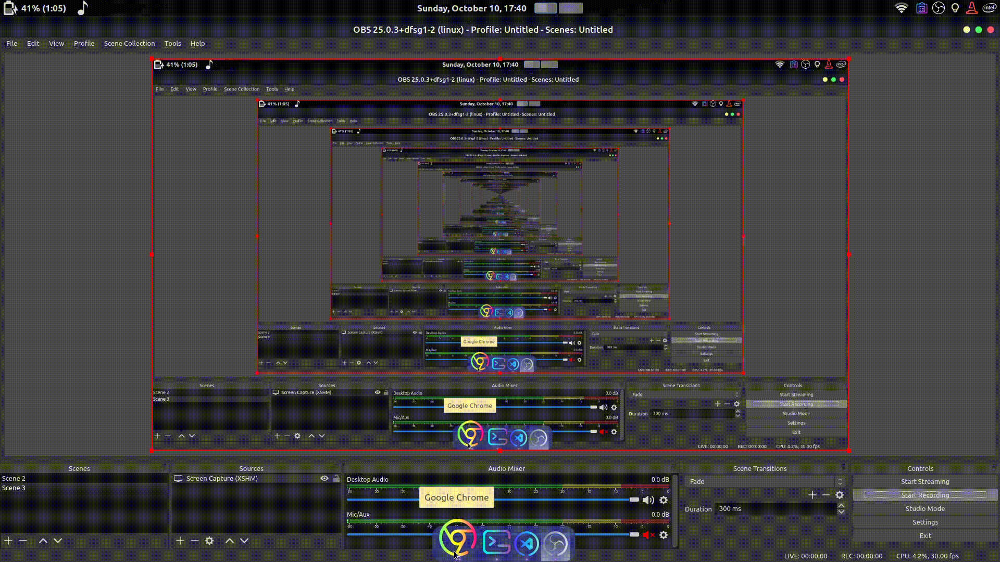

# Weather-js

Monitor realtime weather of cities.
 
Automatically detects your location to show forecast or you can search the weather of a specific city.

## [DEPLOYED HERE](https://weather-realtime.netlify.app/)

url - https://weather-realtime.netlify.app/

## Gif

## API used

- [openweathermap](https://openweathermap.org/api)
- [ipoinfo](https://ipinfo.io/json)
